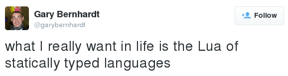
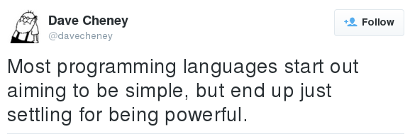

---

# Ducks

are a simple, statically duck-typed programming language

---

# Ducks: the 's' stands for

 * Several

 * "Singular already taken"

 * Simple

 * Static

 * Structural

 * Scalable?

 * Duckslang

---

# What Ducks are aimed at

 * *Primarily*: Java, C#, Go, Swift

   Should be able to win on power and simplicity both at the same time

 * *Also*: JavaScript, Lua, Ruby, Python

   Can we get the ergonomic overhead low enough for quick-and-dirty stuff?

 * *To a considerable extent*: Haskell, OCaml, Scala, F#

   A tradeoff: types won't be quite as powerful ("Hasochism"), ergonomics might be better.

 * *Quite unlikely*: Rust, C++, Idris

   These *can* all be used as applications programming languages, like Ducks, but... 

 * *Inconceivable*: C, Coq, Agda

   These use cases do not overlap even a tiny little bit.
 
---

# A brief note on syntax

Broadly in the C/JavaScript tradition, for accessibility.

Otherwise little is set in stone: most of it is still extremely fluid, even gaseous.

I try not to get too distracted by it, which is hard. Please try the same!

Also: it's strictly evaluated, for the same reason.

---

# Okay, where do we start?

 * Structural records ("static duck-typing")

   "If the names match and the types match, then it's probably fine"

 * Structural variants

 * First-class functions

 * Type aliases, maybe?

 * Simplicity comes from clarity of ideas and good choice of primitives

---

# Structural records

"Extensible records with scoped labels" Daan Leijen

Duplicate labels are okay! You just get the outermost one.

Makes things simpler: no "lacks" constraints. And now it's *really* a product type!

Structure is actually kind of like record-of-tuples: duplicates are ordered, different names aren't.

    (a: Real, b: Bool, c: Color)

    (a$0: Int, a$1: Real, b$0: Bool, c$0: Color)

---

# Structural records, ctd.

Functions with named parameters are good for readability.

Actually, every function just takes a record as parameter:

    fn say(to: String, greeting: String) { greeting ++ ", " ++ to }

    say(to "World", greeting "Hello")

What if local variables are also just fields of a record?

No separate notion of name resolution.

All name resolution is just record field access!

---

# Structural variants

Same basic idea, also for sum types:

    type Bool = (case yes, case no)

    type Maybe(T) = (case yes: T, case no)

Match refinement!

    fn foobar(arg: (case foo, case bar)) { ... }
    fn foobarbaz(arg: (case foo, case bar, case baz)) {
        match arg {
            case baz => handle_baz(),
            x        => foobar(x),   // OK!
        }
    }

Try emulating that in Haskell! It's messy.

(Also maybe: "vertical" function composition?)

---

# Equirecursive types?

    type List(T)         = Maybe(NonEmptyList(T))

    type NonEmptyList(T) = (head: T, tail: List(T))

---

# Modules

Can we maybe "just" (*"just"*) have types as components of records...?

"1ML - Core and modules united (F-ing first-class modules)" Andreas Rossberg

Yes we can!

Module = Record

Universal quantification is just a function with a type as one of its arguments.

Existential quantification is just `type Showy = (type T, value: T, show: fn(val: T) -> String)`

Syntactically, Uppercase Stuff Is "Type-Level". So this might be explicit type application:

    map(T Int, list my_list, each_elem fn(elem) elem + 1)

---

# Purity

Can we distinguish pure and impure functions without being too burdensome?

Should be able to write `map` and have it "just work" for both!

Should never have to write or see an effect variable!

Intuition: An "effect" is any such *thing* where, given a HOF `g` with argument `f`, then `g(f)` does *the thing* if `f` does *the thing*.

Examples: IO, mutation, exceptions, nontermination (abort), contract violations, accessing transaction variables, ...

Plain `fn()` is always implicitly quantified over its effects

Can explicitly annotate as: `io fn()`, `atomic fn()`, `dangerous fn()`

Pure functions: `const fn()`, meaning "output is constant for each given input"

[Frank, Eff, Koka...?]

---

# Laziness

It has to be explicit, somehow, but can we make it useful and ergonomic (*and* simple)?

Just automatically memoize `const fn() -> T`! Call-by-need beats call-by-name.

*Delaying* into thunks is *implicit*:

 * An expression `foo(bar(), baz())` can be typed as either value `Foo`: effects happen now (propagate to the caller),

 * or as function `fn() -> Foo`: effects are captured into the closure (happen later).

*Forcing* them is always *explicit*:

 * The site of potential effects should always be visible! As a function call: `foo()`. Programmers know this.

 * Nontermination ("bottom") is always a potential effect!

All of this actually works equally well for effectful ("impure") `fn`s! The only difference is the memoization.

So you can write your own control structures.

---

# Generative abstraction

Cottage industry of papers around "generative functors" versus "applicative functors" (ML sense, not Haskell).

Also called "impure" and "pure".

What it boils down to (I think):

    const fn pure(input: Int) -> type { ... }

    io fn impure(input: Int) -> type { ... }

    type A1 = pure(1); type B1 = pure(1); // A1 == B1, a pure function must always return the same result

    type A2 = impure(2); type B2 = impure(2); // A2 != B2, an impure function won't necessarily!

This is kind of like memoization of `const fn`s at the type level.

---

# Mutability polymorphism

Would like robust support for local mutability and imperative programming.

Reason: once again, accessibility and providing a smooth transition. Most people are not accustomed to thinking recursively.

"Local mutability" means: immutable data is still immutable, and pure functions are still pure. ST monad. `mut fn`.

But can we avoid having completely separate `Array(T)` and `MutableArray(T)` types?

Idea: Reading from an immutable `Array(T)` is pure *only because nobody else is writing to it*! 

So parameterize it over an effect!

    // effect-polymorphic: works for both `const Array(T)` and `mut Array(T)`!
    fn read(type T, array: Array(T), index: Int) -> T { ... }

    // can't write to `const Array`s
    mut fn write(type T, array: mut Array(T), index: Int, value: T) { ... }

    // fn freeze, fn thaw, etc.

So now there's only one type, and the read-only code can be written only once.

---

# Parallelism, concurrency

STM: `atomic fn()`, `atomic { }`, ...

Parallel evaluation of pure functions:

    // Begins parallel evaluation; use result function to `wait` for the result.
    fn par(type T, f: const fn() -> T) -> (wait: const fn() -> T)

Mutexes:

    io fn withLock(type T, type Result, mutex: Mutex(T), body: fn(contents: mut Ref(T)) -> Result) -> Result
    // h/t Rust

Concurrent revisions? (Daan Leijen again)
IVars?

---

# Vertically Integrated Ducks

 * "Object-Relational Impedance Mismatch", or "The ORM problem"

   * People want to talk to relational databases

   * They need to use SQL for that, but the rest of their code is in (Haskell C# Java ...)

   * Raw untyped strings? Painful!!

   * So they write bindings to turn SQL rows into native objects, native expressions into SQL queries, and so on (an ORM).

   * Then they write another, because the none of these are ever really satisfactory.

   * Best practice is actually to put the logic into the database! But who wants to write PL/SQL?

 * The solution: `type Ducks = Relation(name: String, age: Int, sound: Quack)`?

 * The database eats the programming language! (or vice versa?)

 * Maybe instead of SQLite, people can embed Ducks.

 * Program optimization is query optimization?

---

# Biggest blind spots

 * Type inference

   HM? BiDi? MLF? Just do what 1ML does?

 * Subtyping
 
   Is row polymorphism enough?

 * Ad-hoc polymorphism (overloading)

   Modular typeclasses / modular implicits? "Uppercase Stuff Is Inferred"?

 * Lenses, prisms, first-class patterns, first-class labels, ...?

 * What actually are coroutines? Why are there so many flavors?

---

# Blind spots

 * ~~Modules~~

 * ~~Abstract types~~

 * ~~Purity~~

 * ~~Laziness~~

 * ~~Value restriction~~

 * ~~Mutability polymorphism~~

---

# What do I have so far

    glaebhoerl:/misc/ducks$ cat *.txt | grep -Pe '\S' | wc -l
    2166
    glaebhoerl:/misc/ducks$ cat *.txt | grep '?' | wc -l
    1079
    glaebhoerl:/misc/ducks$ cat *.hs *.rs *.h *.c *.cpp | wc -l
    0

---

# What does the future hold?

Actually doing things is scary.

I tend to get stuck in the idea-generation phase, because there's less risk of getting discouraged.

Maybe doing things collaboratively is less scary? (a theorem to be demonstrated by constructive proof?)

---

# It would be nice to...

 * Start writing a prototype interpreter in Haskell?

 * Figure out the remaining bits (hopefully?)

 * Eventually write an optimizing compiler-as-libraries and runtime in Rust

---

# Stay in touch

https://twitter.com/glaebhoerl

glaebhoerl@gmail.com

https://github.com/glaebhoerl/ducks/presentation.md

I'm still here Thursday

---

# Implementation

## "Intensional type analysis"1 (maybe)

 * *Not* uniform representation

   Data is unboxed for better memory density and cache locality; types have different sizes

 * `type` has runtime representation like any other (non-unit) type

   Its size and alignment, a type-specific GC routine, maybe a debug-printer...

   Generic code can use these to correctly manipulate the type at runtime

 * Specialize all the things! (C++, Rust)

 * Higher-order polymorphism should first try to dispatch to a specialized version...

 * before actually falling back to the "slow case" of runtime memory calculations.

1 Unrelated to *intensional type theory*.

---

# Scale invariance

 * No distinguished notion of "top-level scope" or "module scope"

 * Modules are just records (large-scale structure ~ small-scale structure)

 * ITA provides smooth transition between separate and whole-program compilation

 * Elimination of ceremony and coordination
 
---

# DucksDB, Ctd.

Potential connections

 * Views -> FP functions, FRP behaviors?
 * Transactions -> STM?
 * Persistent revision control -> functional revisions?
 * Queries -> monads (LINQ)?
 * Integrity constraints -> refinement types?

---

# What else can Ducks eat?

 * Nix?

 * FRP?

 * Cap'n Proto?

 * Git??

---

# Exceptions

TODO

fn throws

---

# So what are the primitives?
 
    data Type = Type
              | PrimType PrimType
              | Record Row
              | Enumeration Row
              | Function Effects Type Type

    type Row = Map Name (NonEmptyList Type)

    data PrimType = Int | UInt | Real | Array Effects Type | Ref Effects Type

    type Effects = Set Effect

    data Effect = IO
                | Mut Region
                | Atomic
                | Dangerous
                | Throws (Map Name Type) -- maybe?

---

# Why not dependent types

Do not want:

 * GADTs

 * Propositional equality

 * `T1 = T2` anywhere in the syntax

If I go down that road, I want to do it *right* with full-spectrum dependent types...

...but then I would need to read another 100 papers and spend another 10 years thinking about it before starting anything.

